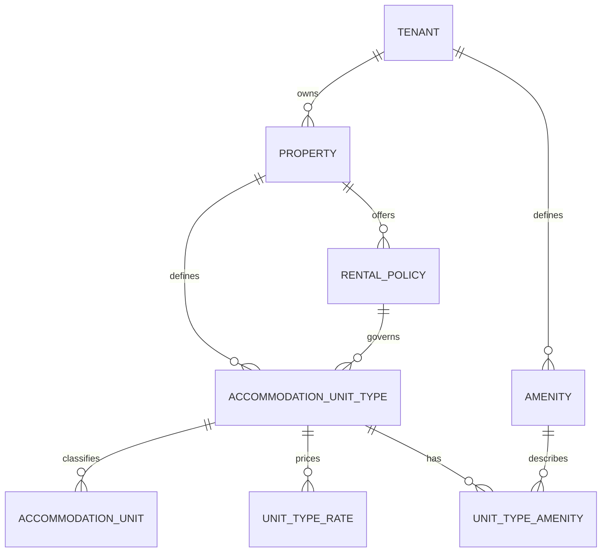

# Accommodation domain

The accommodation domain describes what a property can offer for rent. It does
not model bookings, occupants, check-ins or payments.

## Model

## Accommodation units

An `AccommodationUnit` is the smallest item rented exclusively as a whole. A
unit has a physical identity, represented by a code such as `A402`, and belongs
to an `AccommodationUnitType` such as “Double room with AC”. Floor label,
display name and notes are optional.

The abstraction can support other indivisible rentable items without changing
the surrounding model. The only supported `AccommodationUnitKind` at present
is `room`, and it is the database default.

Units and unit types are archived rather than reused as unrelated records.
Active unit codes and active unit-type names are unique within a property.

## Properties

A tenant may operate multiple properties. Currency and timezone are property
attributes because they apply to the property's rates and operating times.

Property-specific records carry both `tenant_id` and `property_id`. Composite
foreign keys ensure that their property, policy and unit-type references remain
within the same tenant and property.

## Amenities

Amenities are tenant-defined records associated with unit types through an
explicit mapping table. Defining them at tenant level allows an operator to
reuse the same amenity across properties.

## Rental policies

A rental policy describes how the rental period is interpreted:

- A rolling-duration policy has a duration in minutes and no fixed check-in or
  check-out times.
- A calendar-night policy has fixed check-in and check-out times and no duration
  in minutes.

The database enforces the required shape for each policy kind and requires a
non-negative grace period.

## Rates

Rates belong to a unit type and store an amount in the property's minor currency
unit. Currency is obtained from the property and is not repeated on each rate.

Each rate has a required `valid_from` date and an optional `valid_to` date.
PostgreSQL represents these as half-open ranges: the start is included and the
end is excluded. An exclusion constraint prevents rate periods for the same
unit type from overlapping while allowing adjacent periods.
